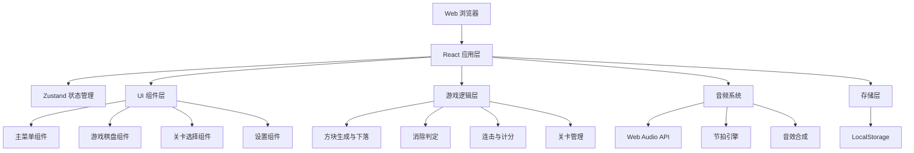

## 1. 架构设计



## 2. 技术描述

- **前端框架**：React@18 + TypeScript
- **构建工具**：Vite@5
- **样式方案**：Tailwind CSS@3
- **状态管理**：Zustand@4
- **路由管理**：React Router DOM@6
- **图标库**：Lucide React
- **音频**：Web Audio API（原生浏览器 API，无需外部音频文件）
- **数据存储**：LocalStorage（浏览器本地存储）
- **无后端、无外部接口、纯前端运行**

## 3. 目录结构

```
src/
├── components/          # 组件目录
│   ├── GameBoard.tsx    # 游戏棋盘组件
│   ├── Block.tsx        # 单个方块组件
│   ├── BeatIndicator.tsx # 节拍指示器
│   ├── ScorePanel.tsx   # 分数面板
│   ├── MenuButton.tsx   # 菜单按钮
│   ├── LevelSelect.tsx  # 关卡选择
│   └── Settings.tsx     # 设置组件
├── hooks/               # 自定义 Hooks
│   ├── useGameLogic.ts  # 游戏逻辑 Hook
│   ├── useAudio.ts      # 音频系统 Hook
│   └── useLocalStorage.ts # 本地存储 Hook
├── stores/              # Zustand 状态管理
│   ├── gameStore.ts     # 游戏状态
│   └── settingsStore.ts # 设置状态
├── pages/               # 页面组件
│   ├── MainMenu.tsx     # 主菜单页
│   ├── Game.tsx         # 游戏页
│   └── SettingsPage.tsx # 设置页
├── utils/               # 工具函数
│   ├── audio.ts         # 音频合成工具
│   ├── beat.ts          # 节拍计算
│   ├── constants.ts     # 常量配置
│   └── helpers.ts       # 通用辅助函数
├── types/               # TypeScript 类型定义
│   └── index.ts         # 类型定义
├── App.tsx              # 应用入口
├── main.tsx             # React 入口
└── index.css            # 全局样式
```

## 4. 路由定义

| 路由 | 页面 | 功能 |
|------|------|------|
| `/` | 主菜单 | 游戏入口，开始游戏、关卡选择、设置入口 |
| `/game/:level` | 游戏页面 | 核心游戏玩法 |
| `/levels` | 关卡选择 | 选择已解锁的关卡 |
| `/settings` | 设置页面 | 音量、按键、数据管理 |

## 5. 数据模型

### 5.1 游戏状态类型

```typescript
// 方块颜色类型
type BlockColor = 'cyan' | 'magenta' | 'yellow' | 'blue' | 'green';

// 单个方块
interface Block {
  id: string;
  color: BlockColor;
  row: number;
  col: number;
  selected: boolean;
  falling: boolean;
}

// 游戏状态
interface GameState {
  grid: (Block | null)[][];
  score: number;
  combo: number;
  multiplier: number;
  level: number;
  isPlaying: boolean;
  isPaused: boolean;
  isGameOver: boolean;
  selectedBlocks: Block[];
  beatCount: number;
  isStrongBeat: boolean;
  perfectWindow: boolean;
}

// 关卡配置
interface LevelConfig {
  level: number;
  bpm: number;
  colors: number;
  rows: number;
  cols: number;
  unlockScore: number;
}

// 玩家数据
interface PlayerData {
  highScore: number;
  unlockedLevel: number;
  levelScores: Record<number, number>;
}

// 设置
interface Settings {
  volume: number;
  muted: boolean;
  keyBindings: KeyBindings;
}

interface KeyBindings {
  up: string;
  down: string;
  left: string;
  right: string;
  select: string;
  pause: string;
}
```

### 5.2 本地存储键值

| 键名 | 类型 | 说明 |
|------|------|------|
| `rhythm_blocks_player_data` | `PlayerData` | 玩家数据（最高分、解锁关卡） |
| `rhythm_blocks_settings` | `Settings` | 用户设置 |

## 6. 核心模块说明

### 6.1 节拍引擎 (Beat Engine)
- 使用 `setInterval` 或 `requestAnimationFrame` 维持节拍
- BPM 根据关卡配置动态调整
- 4/4 拍，第 1 拍为强拍
- 强拍窗口时间约 150ms，此窗口内消除判定为完美消除

### 6.2 音频系统 (Audio System)
- 使用 Web Audio API 的 `OscillatorNode` 合成音效
- 消除音高根据连击数调整：基础音 + 半音 × 连击数
- 音阶采用大调五声音阶，确保和谐
- 强拍播放低频鼓点音
- 完美消除播放和弦音效

### 6.3 消除判定 (Match Detection)
- 检测选中方块是否全部同色
- 检测选中方块是否相邻（上下左右连通）
- 选中数量 ≥ 3 触发消除
- 消除后方块下落填充空位

### 6.4 计分系统
- 基础分 = 消除方块数 × 10
- 倍率 = 1 + (连击数 - 1) × 0.5
- 完美消除额外 × 1.5 倍
- 最终得分 = 基础分 × 倍率 × 完美加成
