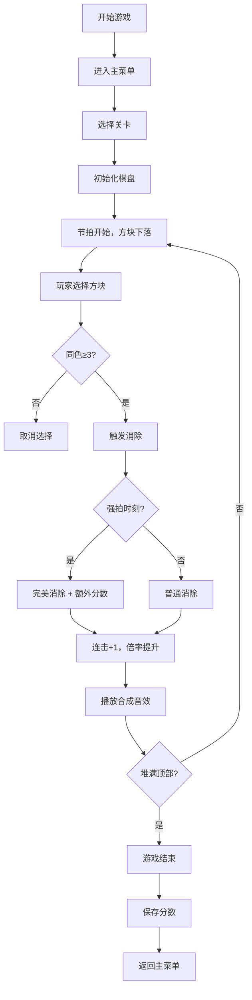

## 1. 产品概述

「节奏方块消除」是一款主打手脑协调和节奏感的纯前端休闲小游戏，无需联网、无需加载音频文件，打开网页即可游玩。玩家需要在方块随节拍下落的过程中，通过点击或键盘连接三个以上同色方块进行消除，配合节拍系统获得高分。

- 目标用户：喜欢休闲益智类游戏、追求节奏感和操作感的玩家
- 产品价值：提供轻量化、高爽点的游戏体验，锻炼玩家的反应能力和节奏感

## 2. 核心功能

### 2.1 功能模块

1. **主菜单页面**：游戏标题、开始游戏、关卡选择、设置入口、最高分展示
2. **游戏页面**：网格棋盘、分数显示、连击倍率、节拍指示器、暂停按钮
3. **关卡系统**：多关卡递进，节拍速度递增、方块颜色种类递增
4. **设置页面**：音量控制、按键设置、重置数据

### 2.2 页面详情

| 页面名称 | 模块名称 | 功能描述 |
|---------|---------|---------|
| 主菜单 | 标题区域 | 动态霓虹游戏标题，配合节拍闪烁 |
| 主菜单 | 开始游戏 | 进入当前已解锁的最高关卡 |
| 主菜单 | 关卡选择 | 展示所有关卡，已解锁可点击，未解锁显示锁定状态 |
| 主菜单 | 设置入口 | 进入设置页面 |
| 主菜单 | 最高分 | 显示历史最高分和当前解锁关卡 |
| 游戏页面 | 网格棋盘 | 方块下落、选中高亮、消除动画 |
| 游戏页面 | 信息面板 | 当前分数、连击数、倍率、关卡、节拍指示器 |
| 游戏页面 | 操作区域 | 鼠标点击拖拽选择、键盘方向键控制 |
| 游戏页面 | 暂停功能 | 暂停/继续游戏、返回主菜单 |
| 设置页面 | 音量控制 | 调节音效音量、静音开关 |
| 设置页面 | 按键设置 | 自定义键盘快捷键 |
| 设置页面 | 数据管理 | 重置本地存储数据 |

## 3. 核心流程

### 3.1 用户游戏流程

玩家打开游戏进入主菜单，选择关卡后开始游戏。方块按照固定节拍从上往下逐行掉落，玩家通过鼠标点击拖拽或键盘操作选择相邻的同色方块（三个以上），释放后触发消除。消除时播放合成音效，连击越多音调越高、分数倍率越大。强拍时格子闪烁，在强拍时刻消除可获得「完美」加分，错过强拍则倍率归零。当方块堆积到顶部时游戏结束，记录分数并更新最高分。

## 4. 用户界面设计

### 4.1 设计风格

**霓虹赛博朋克风格**
- 主色调：深邃黑色背景 `#0a0a0f`，配合霓虹青 `#00f0ff`、霓虹粉 `#ff00ff`、霓虹黄 `#ffff00`、霓虹蓝 `#0066ff`、霓虹绿 `#00ff66`
- 按钮风格：圆角矩形，霓虹发光边框，悬停时亮度提升
- 字体：标题使用 `Press Start 2P` 像素字体，数字使用 `VT323` 等宽字体，正文使用 `Orbitron` 未来感字体
- 布局：居中对称布局，游戏棋盘为视觉中心，信息面板环绕四周
- 动画：方块消除时爆炸粒子效果，强拍时整屏闪烁，连击数字跳动动画

### 4.2 页面设计概览

| 页面名称 | 模块名称 | UI 元素 |
|---------|---------|---------|
| 主菜单 | 标题区域 | 大字号霓虹标题，逐字渐变发光动画 |
| 主菜单 | 菜单按钮 | 垂直排列，霓虹边框，hover 时发光扩散 |
| 主菜单 | 最高分显示 | 右下角小区域，显示最高分数和解锁进度 |
| 游戏页面 | 棋盘区域 | 居中网格，方块带发光效果，选中时边框加粗 |
| 游戏页面 | 顶部信息栏 | 分数、连击、倍率、关卡数字，霓虹色区分 |
| 游戏页面 | 节拍指示器 | 底部中心脉冲圆环，强拍时剧烈闪烁 |
| 游戏页面 | 暂停按钮 | 右上角透明圆形按钮 |
| 设置页面 | 滑块控件 | 音量滑块，霓虹色填充 |
| 设置页面 | 切换开关 | 扁平风格开关，开启时霓虹发光 |

### 4.3 响应式

- 桌面端优先，适配 1024px 及以上宽度
- 平板端：棋盘等比例缩小，按钮区域调整
- 移动端：触控优化，按钮增大，简化布局
- 触摸滑动选择方块，替代鼠标拖拽

### 4.4 视觉特效

- **方块颜色**：5 种霓虹色方块，每种颜色有独特的发光效果
- **消除特效**：方块消除时向四周发射彩色粒子，伴随缩放消失动画
- **强拍提示**：每到强拍整个棋盘边框闪烁白光，节拍指示器放大
- **完美消除**：显示「PERFECT!」金色文字，向上飘动消失
- **连击特效**：连击数达到 5 以上时屏幕边缘出现彩虹光晕
- **背景**：深色网格背景，轻微的扫描线动画效果
